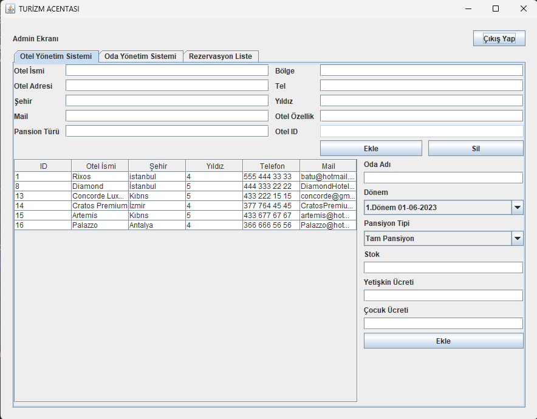

# Turizm Acenta Sistemi

## Proje Açıklaması

Bu proje, bir turizm acentasının temel işlemlerini yönetmek amacıyla geliştirilmiş bir yazılım sistemidir. Sistem, kullanıcıların giriş yaparak rezervasyon yapmalarını, otel yönetimini kontrol etmelerini ve genel acente işlemlerini gerçekleştirmelerini sağlar.

## Proje Yapısı

Proje, MVC (Model-View-Controller) mimarisini temel alır ve işlemlerini üç ana parçada gerçekleştirir: `helper`, `model` ve `view`.

1. **Helper:** Sistemdeki yardımcı işlemleri yönetir. Veritabanı işlemleri, otel yönetimi ve rezervasyon listesi gibi temel işlevselliği içerir.

2. **Model:** Veritabanı işlemleri ve veri yapısı ile ilgili işlemleri yönetir. Kullanıcılar, oteller ve rezervasyonlar gibi veritabanı entegrasyonunu sağlar.

3. **View:** Kullanıcı arayüzlerini oluşturur. Login, Employee, Admin ve Reservation arayüzlerini içerir.

## Kullanıcı Arayüzleri

Projede toplam dört farklı arayüz bulunmaktadır:

1. **LoginGUI:** Giriş ekranı, kullanıcı adı ve şifre ile sisteme erişim sağlar.

)

2. **EmployeeGUI:** Acenta çalışanlarının kullanabileceği arayüz. Üç ana bölümden oluşur:
  - Otel Yönetim Sistemi
   
  - Oda Yönetim Sistemi
    
  - Rezervasyon Listesi
  
  - Oda Ekleme
 

3. **AdminGUI:** Acenta yöneticilerinin kullanabileceği arayüz. Kullanıcı yönetimi ve arama özelliklerini içerir.

4. **ReservationGUI:** Rezervasyon işlemlerini yönetir. İletişim bilgileri ve rezervasyon detayları gibi verileri alır.
   
